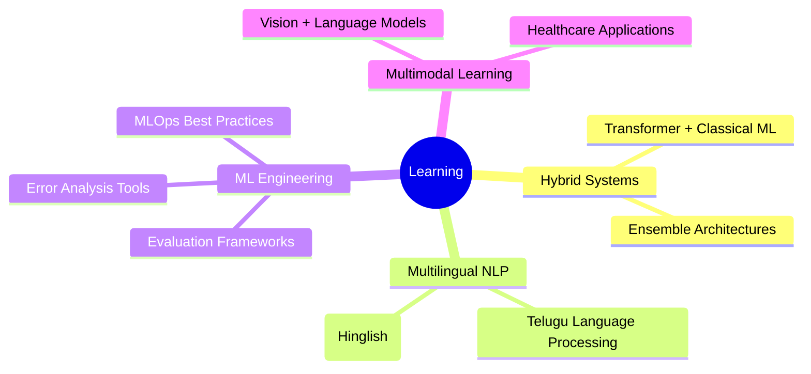

<!-- ================= HEADER ================= -->
<div align="center">
  
</div>

<p align="center">
  
</p>

<p align="center">
  
  
</p>

---

## 💫 About Me

I am an **AI/ML-focused Computer Science undergraduate** pursuing **B.Tech in CSE (AI & ML)** at **VIT-AP University**, with hands-on experience across **Natural Language Processing, Deep Learning, and Reinforcement Learning**.

My work emphasizes **building end-to-end machine learning systems** with strong attention to:
- 📊 Data quality and preprocessing pipelines
- 🎯 Rigorous evaluation and error analysis
- ⚡ Model efficiency and optimization
- 🔄 Reproducibility and clean code practices

I use GitHub as a **technical journal** to document experiments, benchmark models, and maintain structured ML pipelines that reflect both **research depth and engineering discipline**.

---

## 🧠 Core Expertise

<table>
<tr>
<td width="50%">

### 🔬 Research Focus
- Applied Machine Learning & Evaluation
- NLP with Transformer Models
- Deep Learning for Healthcare
- Reinforcement Learning Algorithms

</td>
<td width="50%">

### 🛠️ Engineering Skills
- End-to-end ML Pipeline Development
- Model Fine-tuning & Optimization
- Deployment-aware AI Systems
- MLOps & System Design

</td>
</tr>
</table>

---

## 🚀 Featured Projects

<details open>
<summary><b>🔍 Natural Language Processing</b></summary>
<br>

**📄 Plagiarism Detection System**
- Transformer-based plagiarism detection on PDF documents
- Custom preprocessing pipeline using PyMuPDF
- Fine-tuned language models with attention visualization

**📰 Fake News Detection**
- Complete NLP pipeline: TF-IDF + Logistic Regression baseline
- BERT fine-tuning with comprehensive evaluation metrics
- Real-time inference API

</details>

<details>
<summary><b>🎮 Reinforcement Learning</b></summary>
<br>

**🏋️ Hybrid RL Strategies – CartPole**
- Comparative analysis: Hill Climbing, DDQN, and hybrid approaches
- Achieved 30% faster convergence with hybrid strategy
- Detailed ablation studies and visualization

</details>

<details>
<summary><b>🩺 Healthcare AI</b></summary>
<br>

**🔬 Skin Cancer Detection**
- CNN-based medical image classification
- ResNet and EfficientNet architectures
- ROC/PR curve analysis with clinical metrics

</details>

<details>
<summary><b>📈 Time Series & Forecasting</b></summary>
<br>

**💹 Stock Price Prediction**
- LSTM-based time-series forecasting
- Hyperparameter optimization with Optuna
- Interactive Streamlit dashboard

</details>

---

## 🧰 Technology Stack

<table>
<tr>
<td valign="top" width="33%">

### 💻 Languages
<div align="center">

</div>

</td>
<td valign="top" width="33%">

### 🤖 ML/DL Frameworks
<div align="center">

<br><br>


</div>

</td>
<td valign="top" width="33%">

### 🛠️ Tools & Platforms
<div align="center">

<br><br>


</div>

</td>
</tr>
</table>

<details>
<summary><b>📚 Additional Libraries & Tools</b></summary>
<br>

```python
data_science = ['NumPy', 'Pandas', 'Matplotlib', 'Seaborn', 'Plotly']
nlp_tools = ['NLTK', 'SpaCy', 'Transformers', 'SentenceTransformers']
ml_ops = ['MLflow', 'Weights & Biases', 'DVC', 'Optuna']
deployment = ['FastAPI', 'Streamlit', 'Gradio', 'Docker']
```

</details>

---

## 📌 Current Focus



---

## 📊 GitHub Analytics

<p align="center">
  
  
</p>

<p align="center">
  
</p>

---

## 🌱 Beyond Coding

- 📖 Reading about **ML System Design & MLOps**
- ✍️ Writing technical documentation and research notes
- 🎯 Contributing to open-source ML projects
- 🏆 Leadership through academics and sports

---

## 🌐 Let's Connect

<p align="center">
  <a href="https://linkedin.com/in/jayavanth18">
    
  </a>
  <a href="mailto:athotaj.pegasian@gmail.com">
    
  </a>
  <a href="https://github.com/jayavanth18">
    
  </a>
</p>

<p align="center">
  <i>💡 Open to collaborations on AI/ML research projects and innovative applications</i>
</p>

---

<div align="center">
  
</div>

<p align="center">
  
</p>
